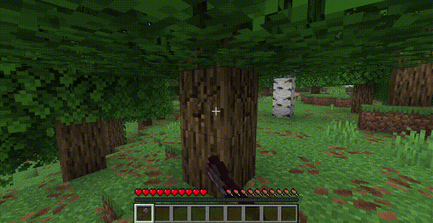

# Leaf Decay Instant



Tired of floating leaves after cutting down a tree? **Leaf Decay Instant** removes them immediately — no more ugly leaf blobs hovering in the sky.

---

## Features

- **Instant decay** — leaves disappear the moment they lose connection to a log
- **Chain decay mode** — watch leaves cascade in a satisfying wave from the trunk outwards
- **Extra drops** — configurable bonus chance for saplings, sticks, and apples
- **Sound variety** — multiple break sounds with configurable chance and pitch
- **Particle options** — choose between leaf texture, composter, or happy villager particles
- **In-game commands** — change any setting at runtime with `/leafdecay set <option> <value>`
- **Performance friendly** — uses Minecraft's native tick system, minimal overhead
- **Highly configurable** — 20+ options to tune the mod to your taste
- **Mod compatible** — works with any mod that extends the base `LeavesBlock`
- **Server-side** — clients don't need the mod installed

---

## Installation

1. Install [Fabric Loader](https://fabricmc.net/use/)
2. Install [Fabric API](https://modrinth.com/mod/fabric-api)
3. Download and drop the `.jar` into your `mods` folder

---

## Commands

> **Note:** Commands require OP level 2. On multiplayer servers, use LuckPerms to restrict `/leafdecay` to staff.

```
/leafdecay reload
/leafdecay set <option> <value>
```

**Examples:**
```
/leafdecay set chainDecay true
/leafdecay set chainDelay 3
/leafdecay set soundChance 0.5
/leafdecay set particleType composter
/leafdecay set extraSaplingChance 2.0
/leafdecay reload
```

---

## Configuration

Config file is created on first launch at `config/instant_leaf_decay.json`.

### Core

| Option | Type | Default | Description |
|--------|------|---------|-------------|
| `enabled` | bool | `true` | Master toggle |
| `decayTicks` | int | `2` | Ticks to wait before leaves decay |

### Particles

| Option | Type | Default | Description |
|--------|------|---------|-------------|
| `particles` | bool | `true` | Enable particle effects |
| `particleCount` | int | `8` | Number of particles per decay |
| `particleType` | string | `"block"` | `"block"`, `"composter"`, or `"happy"` |

### Sound

| Option | Type | Default | Description |
|--------|------|---------|-------------|
| `sound` | bool | `true` | Enable sound effects |
| `soundVolume` | float | `0.8` | Volume (0.0 – 1.0) |
| `soundPitchMin` | float | `1.0` | Minimum pitch |
| `soundPitchMax` | float | `1.2` | Maximum pitch |
| `soundChance` | float | `0.3` | Chance per leaf to play sound |

**Supported sound IDs:**
`minecraft:block.grass.break`, `minecraft:block.azalea_leaves.break`, `minecraft:block.moss.break`, `minecraft:block.azalea.break`, `minecraft:block.flowering_azalea.break`, `minecraft:block.cherry_leaves.break`, `minecraft:block.sweet_berry_bush.break`

### Chain Decay

| Option | Type | Default | Description |
|--------|------|---------|-------------|
| `chainDecay` | bool | `false` | Enable cascading wave decay |
| `chainDelay` | int | `2` | Spread factor (higher = slower wave) |

### Extra Drops

| Option | Type | Default | Description |
|--------|------|---------|-------------|
| `extraSaplingChance` | float | `0.0` | Bonus sapling roll multiplier |
| `extraStickChance` | float | `0.0` | Bonus stick roll multiplier |
| `extraAppleChance` | float | `0.0` | Bonus apple roll (oak/dark oak only) |

### Filters

| Option | Type | Default | Description |
|--------|------|---------|-------------|
| `blacklistedLeaves` | list | `[]` | Block IDs to exclude |
| `disabledDimensions` | list | `[]` | Dimension IDs to disable in |

### Performance

| Option | Type | Default | Description |
|--------|------|---------|-------------|
| `requirePlayerNearby` | bool | `false` | Only decay near players |
| `playerRadius` | float | `64.0` | Player detection radius |

---

## Compatibility

- **Loader:** Fabric
- **Minecraft:** 26.1.x, 26.2-snapshot
- **Requires:** Fabric API
- **Side:** Server-side (clients don't need it)
- **Modded Trees:** Works automatically with any mod extending `LeavesBlock` (Biomes O' Plenty, Terralith, etc.)
- **Backports:** 1.21.x, 1.20.1, 1.19.2, 1.18.2, 1.16.5

---

## License

MIT — free to use, modify, and include in modpacks. No permission needed.
